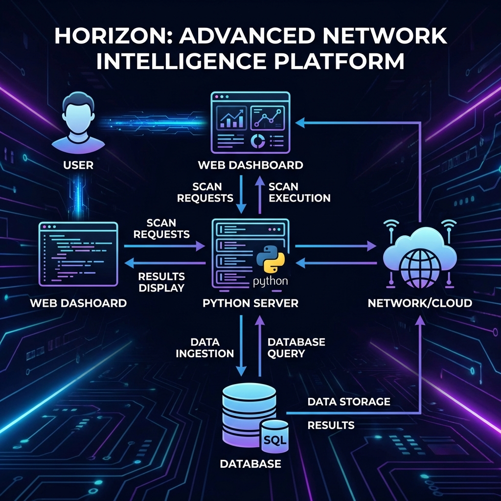
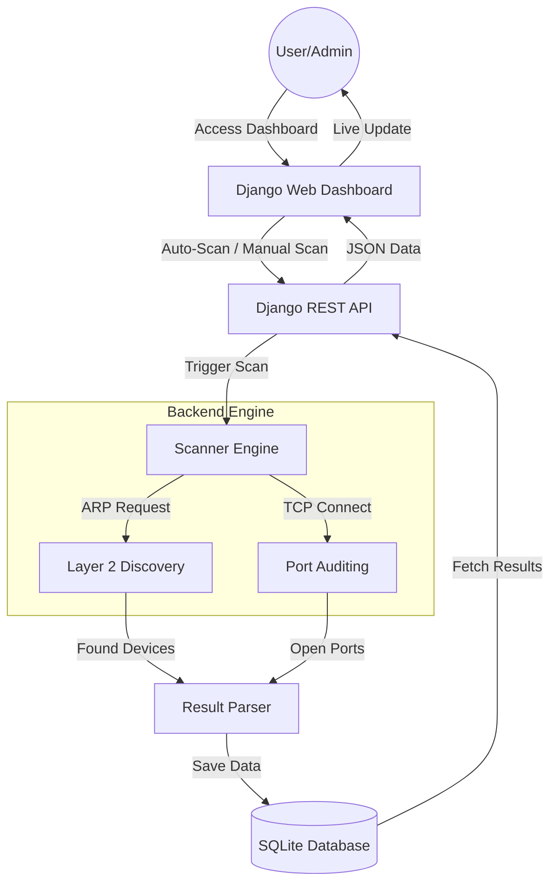
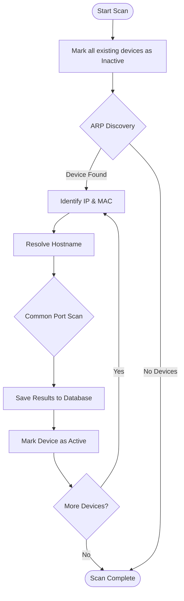
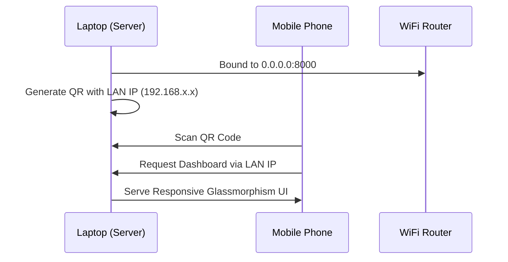

# Project Flowcharts

This document contains visual flowcharts representing the logic and architecture of the Network Scanner Tool.

## 1. Overall System Architecture
This flowchart shows how the User, Django Backend, and Network Scanner Engine interact.

## 2. Scan Logic Flow (Step-by-Step)
This flowchart describes the internal logic of a single network scan.

## 3. Mobile QR Access Flow

