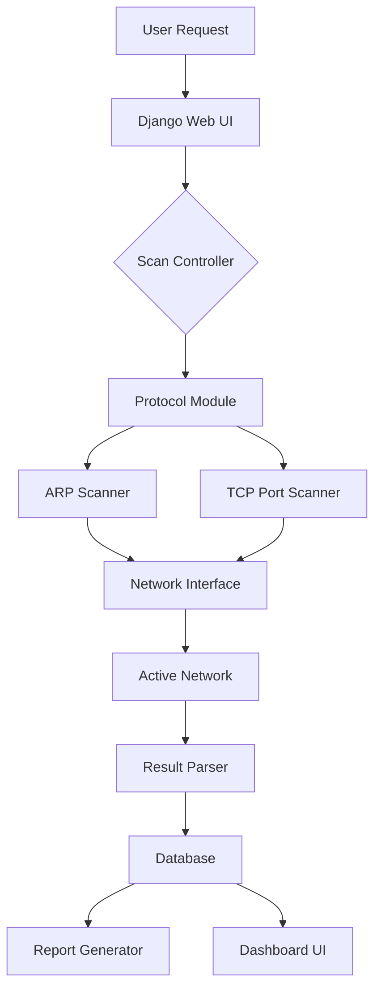

# Project Report: Network Scanner Tool

**Title:** Real-time Network Monitoring and Security Auditing System
**Core Tech:** Python, Django, Scapy
**Purpose:** Final Year Engineering Project

---

## 1. Project Overview
The **Network Scanner Tool** is a sophisticated security application designed for local area network (LAN) auditing. Its primary objective is to provide network administrators with a real-time view of active devices, open services (ports), and potential security vulnerabilities within a subnet.

### 1.1 Objectives
- **Device Discovery:** Automate the identification of all active hosts in a given IP range.
- **Port Auditing:** Identify open ports and the services running on them to detect potential entry points for attackers.
- **Real-time Monitoring:** Provide a dynamic dashboard that updates as devices join or leave the network.
- **Reporting:** Generate professional-grade audit reports for compliance and documentation.

---

## 2. Features
- **LAN / IP Range Scanning:** Supports CIDR notation (e.g., 192.168.1.0/24) for broad network discovery.
- **Active Device Detection:** Extracts vital hardware and software information:
  - **IP Address:** Logical network address.
  - **MAC Address:** Physical hardware address (via ARP).
  - **Hostname:** Resolution of device names.
  - **Vendor Detection:** Identifying device manufacturers based on MAC OUI.
- **Port Scanning:** Multi-threaded scanning of TCP/UDP ports to determine service availability.
- **Subnet Scanning:** Capability to scan multiple subnets across complex network topologies.
- **Result Logging & Export:** Persistent storage of scans with exports available in **CSV**, **JSON**, and **PDF**.
- **Interactive Dashboard:** A web-based UI for visualization and management.

---

## 3. Technology Stack
| Component | Technology | Rationale |
| :--- | :--- | :--- |
| **Backend** | Python | Robust libraries for networking and security. |
| **Networking** | Scapy, Socket | Scapy for low-level packet manipulation; Socket for standard TCP/UDP. |
| **Web Framework** | Django | Secure and scalable backend for the management dashboard. |
| **Database** | SQLite | Efficient storage of scan history and device logs. |
| **Reporting** | ReportLab | For professional PDF generation. |

---

## 4. System Architecture
The system follows a modular architecture where the scanning engine is decoupled from the user interface to ensure high performance.

---

## 5. Modules

### 5.1 Scanner Module
The core engine that interacts with the network hardware. It uses **ARP (Address Resolution Protocol)** for local subnet discovery.

### 5.2 Port Scanner Module
Implements multi-threading to scan ports in seconds. It uses standard TCP connection methods to determine if a port is "Open".

### 5.3 Result Logger Module
Handles the persistence layer. It structures the raw data received from the scanners into a relational database schema.

### 5.4 Dashboard / UI Module
Built with Django and Vanilla JS, this module provides a real-time visualization of the network.

---

## 6. Advantages
- **Security Awareness:** Instantly detect unauthorized devices.
- **Professional UI:** Premium glassmorphism design for a modern look.
- **Mobile Access:** Monitor your network on the go via QR code scanning.
- **Automated Reporting:** One-click PDF reports for documentation.

---

## 7. Conclusion
The **Network Scanner Tool** demonstrates the practical application of socket programming and web development in solving real-world network security challenges. It provides a comprehensive solution for network auditing, suitable for educational and professional use.
