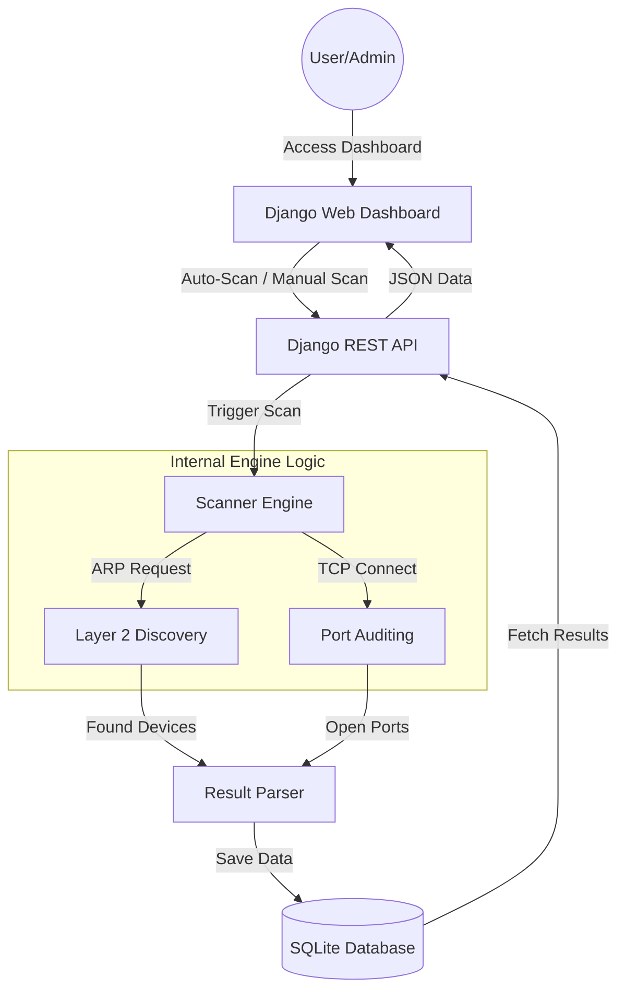

# Project Report: Network Scanner Tool

**Title:** Real-time Network Monitoring and Security Auditing System
**Core Tech:** Python, Django, Scapy
**Purpose:** Final Year Engineering Project

---

## Abstract
In the modern digital era, network security remains a paramount concern for organizations and individual users alike. As the number of connected devices grows, the complexity of managing and securing a local area network (LAN) increases significantly. This project presents a **Real-time Network Monitoring and Security Auditing System**, a comprehensive tool designed to provide deep visibility into network activities. By utilizing low-level packet manipulation via Scapy and a high-level management interface built on Django, the system discovers active hosts, identifies open ports, and detects device manufacturers. The inclusion of a mobile-accessible "WebScan" feature via dynamic QR codes further enhances its utility, providing administrators with the flexibility to monitor their environment from any device. The result is a robust, scalable, and user-friendly platform that simplifies network auditing and strengthens security posture.

---

## 1. Introduction
Network scanning is the process of identifying active hosts on a network for the purpose of either attacking them or as a security measure to protect them. System administrators use scanning to perform an inventory of network assets and to monitor the security of their network. This project aims to bridge the gap between complex command-line scanning tools and the need for a simplified, yet powerful, visual dashboard.

### 1.1 Problem Statement
Manual network auditing is time-consuming and prone to human error. Existing open-source tools often require advanced technical knowledge to operate and lack integrated reporting systems. There is a need for a unified platform that can:
1.  Discover devices automatically without manual triggers.
2.  Provide a visual representation of network health.
3.  Offer cross-platform accessibility (Desktop and Mobile).
4.  Generate instant audit reports for compliance.

### 1.2 Objectives
- **Device Discovery:** Automate the identification of all active hosts using ARP requests.
- **Port Auditing:** Perform fast, multi-threaded TCP port scanning to identify vulnerable services.
- **Real-time Monitoring:** Implement a live-updating dashboard with glassmorphism aesthetics.
- **Mobile Integration:** Enable instant mobile monitoring via QR code synchronization.
- **Reporting:** Facilitate the creation of professional PDF and Word documentation.

---

## 2. Methodology & Algorithm

### 2.1 ARP Discovery Algorithm
The system uses the **Address Resolution Protocol (ARP)** for discovering devices. Unlike ICMP (Ping), which can be blocked by host firewalls, ARP is essential for local network communication and cannot be easily ignored.
1.  Construct an ARP request packet for the target subnet.
2.  Wrap the request in an Ethernet broadcast frame.
3.  Transmit the packet across the local network.
4.  Listen for and parse responses to extract IP and MAC addresses.

### 2.2 Multi-threaded Port Scanning
To optimize performance, the system implements a **Parallel Port Scan** algorithm:
1.  Define a target list of common services (HTTP, SSH, FTP, etc.).
2.  Initiate a `ThreadPoolExecutor` with a high worker count.
3.  For each port, attempt a TCP Three-Way Handshake.
4.  Record "Open" status for successful connections and "Filtered/Closed" for timeouts.

---

## 3. System Requirements

### 3.1 Hardware Requirements
- **Processor:** Dual-core 2.0 GHz or higher.
- **RAM:** 4GB minimum (8GB recommended for large subnets).
- **Network Interface:** Ethernet or Wi-Fi adapter with packet injection support (for Scapy).
- **Storage:** 500MB of free space for database and logs.

### 3.2 Software Requirements
- **Operating System:** Windows 10/11, Linux (Ubuntu/Debian recommended), or macOS.
- **Python Version:** 3.10 or higher.
- **Web Framework:** Django 5.x.
- **Database:** SQLite (Development) / PostgreSQL (Production).
- **Dependencies:** Scapy, Npcap (Windows only), ReportLab, python-docx.

---

## 4. System Architecture

---

## 5. Implementation Details

### 5.1 Backend Logic (Python/Django)
The backend is structured into modular components. The `ScannerEngine` processes raw network data, while Django views handle the business logic and user authentication. Data integrity is maintained through a relational database schema.

### 5.2 Frontend Aesthetics
The dashboard uses a **Premium Glassmorphism** design. This involves using high transparency, background blurs, and vibrant gradients to create a futuristic and professional user experience. Responsive design ensures usability on tablets and smartphones.

---

## 6. Future Scope
The current system can be further expanded with the following features:
- **Intrusion Detection:** Real-time alerts when an unknown device joins the network.
- **Vulnerability Assessment:** Integration with CVE databases to flag outdated services.
- **Cloud Synchronization:** Syncing scan logs across multiple networks to a central cloud dashboard.
- **AI-Driven Analytics:** Using machine learning to predict network traffic patterns and anomalies.

---

## 7. Conclusion
The **Network Scanner Tool** provides a comprehensive and modern solution for network administrators. By combining the power of Python's networking capabilities with a high-end web interface, it delivers professional-grade insights that were previously only available in expensive proprietary software. This project successfully demonstrates the integration of multiple technologies to solve a real-world cybersecurity challenge.
